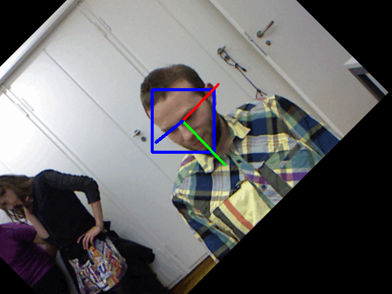

# Toward-Sparse-HPE
This project aims to make head pose estimation without face detection in sparse dataset and robust to occlusion.
This project is the term project for AI convergence project at Inha University with Suprema. 

## Description
Our Head Pose Esitmation (HPE) achieves proper performance and robustness in sparse and masked dataset without using face detection. The details of our project are summarized as follows: 
1. Sparse model architecture based on Retina-Face.
2. Newly generated masked data only for HPE.
3. Trained model with diverse dataset
4. Newly generated rotated dataset in range -45 degree to 45 degree. 

## Pseudocode




## Quick start
* Please go to [here](https://bridge-aix.inha.ac.kr/studio/preview?projectId=48&token=eyJhbGciOiJIUzI1NiJ9.OA.LkEQgaZ3g67mvxL2PYlV6pGn5N6WRBCjwqbTR7Jml6E&nodeName=master).

## Get Started 
Please set requirments.txt to virtual environment or conda. 
### Requirements

*   torch==1.5.1 cu102
*   torchvision==0.6.1
*   numpy>=1.15.0
*   pillow>=8.1.0
*   scipy=1.7.3

### Preparing datasets
Download datasets:
* **300W-LP**, **AFLW2000** from [here](http://www.cbsr.ia.ac.cn/users/xiangyuzhu/projects/3DDFA/main.htm).
* 
* **BIWI** (Biwi Kinect Head Pose Database) from [here](https://icu.ee.ethz.ch/research/datsets.html) 
Store them in the *datasets* directory.
For 300W-LP and AFLW2000 we need to create a *filenamelist*. 
```
python 300_create_filenae_list.py --root_dir datasets/300W_LP
```
### Training
Every dataset should contains HPE, Landmark, Bounding box labels. Please check this out.
```
python 300_create_filenae_list.py --root_dir datasets/300W_LP
```
For training 
```
python3 train.py --dataset BIWI --batch_size 32 --epoch 50 --num_workers 1
```
### Test 
For testing
```
python3 test.py -m ./weights/BIWI/BIWI__Resnet50_Final.pth --dataset BIWI --num_workers 1
```
## Notification
We are not able to upload all dataset and final presentation file due to uploading constraint in Github. We upload the pdf version presentation files, it can be found in /presentation/final_ppt.pdf.
If you have any concerns about dataset and presentation files, please email me. 

## Authors
Kyeontak Han 


